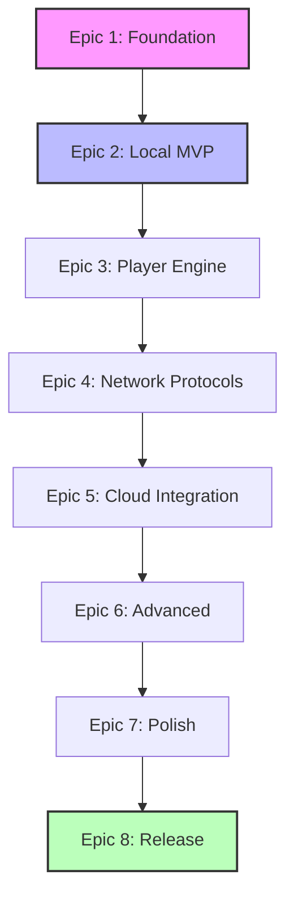

# Strategic Development Plan

**Purpose**: High-level strategic roadmap for the development of FastMediaSorter v2.
**Status**: Master Reference Document
**Scope**: End-to-end implementation from project setup to store release.

---

## Strategic Principles

1.  **Infrastructure First**: Core architecture (Database, DI, Modules) must be solid before UI development.
2.  **Protocol Isolation**: Each network protocol (SMB, SFTP, etc.) is treated as a distinct sub-module to minimize regression risks.
3.  **Vertical Slicing**: Features are implemented Front-to-Back (UI → Domain → Data) to ensure testability at each step.
4.  **No-Estimation Policy**: Focus on **Complexity Points** and **Dependencies** rather than calendar deadlines.
5.  **Strict Sequencing**: Epic N must be stable before starting Epic N+1.

---

## Epic 1: Foundation & Architecture
**Objective**: Establish the "Skeleton" of the application.
**Deliverable**: Compilable Hilt-based project with Database and Base Architecture.

**→ [Tactical Plan: Epic 1](00_strategy_epic1_foundation.md)** - Detailed implementation steps

1.  **Project Initialization**
    *   Setup Android Studio Project (Kotlin DSL, API 28+).
    *   Initialize Git with valid `.gitignore`.
    *   Implement Centralized Dependency Management (`libs.versions.toml`).
2.  **Core Architecture Wiring**
    *   Setup Hilt Dependency Injection graph.
    *   Implement `BaseActivity` and `BaseFragment` with ViewBinding.
    *   Setup Timber Logging and Crash Reporting stubs.
3.  **Data Layer Foundation**
    *   Implement Room Database (`AppDatabase`, Migrations).
    *   Define Core Entities (`ResourceEntity`, `FileOperationHistoryEntity`).
    *   Create DAO interfaces.
4.  **Domain Contracts**
    *   Define `MediaFile` and `Resource` domain models.
    *   Create Repository Interfaces (`ResourceRepository`, `SettingsRepository`).
    *   Define `Result<T>` and Error Handling primitives.

---

## Epic 2: Local File Management (MVP)
**Objective**: Fully functional local file manager.
**Deliverable**: App capable of browsing, viewing, and managing local files.

**→ [Tactical Plan: Epic 2](00_strategy_epic2_local.md)** - Detailed implementation steps

1.  **Permissions & Onboarding**
    *   Implement Storage Permission logic (Android 11+ scoped storage).
    *   Create "Welcome" onboarding flow.
2.  **Local Discovery Engine**
    *   Implement `LocalMediaScanner` (MediaStore + SAF fallback).
    *   Implement `GetMediaFilesUseCase`.
    *   Optimize for 1,000+ files (Pagination groundwork).
3.  **UI Core: Browsing**
    *   Implement `MainActivity` (Resource List).
    *   Implement `BrowseActivity` (Grid/List View).
    *   Create `AddResourceActivity` (Local Folders).
4.  **File Operations System**
    *   Implement Strategy Pattern for File Operations.
    *   Create `LocalOperationStrategy` (Copy, Move, Delete, Rename).
    *   Implement Undo System (trash/recycle bin logic).
    *   Add "Favorites" functionality.
5.  **Universal File Support ("All Files" Mode)**
    *   Implement Global and Resource-level "Work with all files" flag.
    *   Update Scanner to handle non-media types (`MediaType.OTHER`).
    *   Update Player to skip non-media files.

---

## Epic 3: Media Player & Viewer Engine
**Objective**: Universal media consumption capability.
**Deliverable**: Integrated viewer for Images, Video, Audio, and Documents.

**→ [Tactical Plan: Epic 3](00_strategy_epic3_player.md)** - Detailed implementation steps

1.  **Media Display Core**
    *   Implement `PlayerActivity` framework.
    *   Integrate Glide with custom ModelLoaders for encrypted/remote content.
    *   Implement PhotoView (Zoom/Pan).
2.  **Video & Audio Engine**
    *   Integrate ExoPlayer (Media3).
    *   Implement `VideoPlayerManager` (Controls, Gestures).
    *   Implement `AudioPlayerManager` (Service, Notification, Waveform).
3.  **Document Engine**
    *   Integrate PdfRenderer for PDF support.
    *   Implement Text Viewer with encoding detection.
    *   Integrate EPUB Reader (WebView based).
4.  **Editing Capabilities**
    *   Implement Image Editor (Crop, Rotate, Filters).
    *   Implement GIF Editor (extract frames, speed control).

---

## Epic 4: Network Protocols (The Connectivity Layer)
**Objective**: Extend file management to remote servers.
**Deliverable**: SMB, SFTP, and FTP support with local-like experience.

**→ [Tactical Plan: Epic 4](00_strategy_epic4_network.md)** - Detailed implementation steps

1.  **Security & Credentials**
    *   Implement `NetworkCredentialsRepository` (EncryptedSharedPreferences).
    *   Secure Password/Key storage.
2.  **SMB Implementation (Samba)**
    *   Integrate SMBJ library.
    *   Implement `SmbClient` with Connection Pooling.
    *   Create `SmbMediaScanner` and `SmbOperationStrategy`.
3.  **SFTP Implementation (SSH)**
    *   Integrate SSHJ library.
    *   Implement Key/Password Auth.
    *   Create `SftpMediaScanner` and `SftpOperationStrategy`.
4.  **FTP Implementation**
    *   Integrate Commons-Net.
    *   Implement Active/Passive modes.
    *   Create `FtpMediaScanner` and `FtpOperationStrategy`.
5.  **Unified Network Cache**
    *   Implement "Download-View-Upload" pipeline for remote edits.
    *   Structure `UnifiedFileCache` with LRU eviction.

---

## Epic 5: Cloud Integration
**Objective**: Integration with major cloud providers via OAuth.
**Deliverable**: Google Drive, OneDrive, and Dropbox support.

**→ [Tactical Plan: Epic 5](00_strategy_epic5_cloud.md)** - Detailed implementation steps

1.  **OAuth Infrastructure**
    *   Setup Deep Links and Redirect Handlers.
    *   Implement secure Token Storage.
2.  **Google Drive**
    *   Integrate REST API (Drive v3).
    *   Implement Folder Picker and `GoogleDriveOperationStrategy`.
3.  **OneDrive (Microsoft Graph)**
    *   Integrate MSAL (Microsoft Authentication Library).
    *   Implement Graph API calls and `OneDriveOperationStrategy`.
4.  **Dropbox**
    *   Integrate Dropbox Core SDK.
    *   Implement `DropboxOperationStrategy`.

---

## Epic 6: Advanced Capabilities
**Objective**: High-value features leveraging the core engine.
**Deliverable**: OCR, Translation, Search, and Widgets.

**→ [Tactical Plan: Epic 6](00_strategy_epic6_advanced.md)** - Detailed implementation steps

1.  **Intelligence Suite**
    *   Implement ML Kit OCR (Text Recognition).
    *   Implement ML Kit Translation (On-device translation).
    *   Add "Google Lens"-style overlay for Images/PDFs.
2.  **Global Search**
    *   Implement recursive search across resources.
    *   Index text content for Documents.
3.  **Desktop Integration**
    *   Implement App Widgets (`ResourceLaunchWidget`).
    *   Add Shortcuts (App Actions).

---

## Epic 7: Polish & User Experience
**Objective**: Refine the application for production quality.
**Deliverable**: Settings, Localization, Accessibility.

**→ [Tactical Plan: Epic 7](00_strategy_epic7_quality.md)** - Detailed implementation steps

1.  **Settings Ecosystem**
    *   Implement granular Settings Screens (General, Cache, Player).
    *   Add Theme Engine (Dark/Light/System).
2.  **Localization**
    *   Implement strict Locale support (EN, RU, UK).
    *   Verify RTL layout compliance.
3.  **Accessibility**
    *   Audit Content Descriptions.
    *   Verify Touch Target sizing (48dp+).
    *   Ensure TalkBack navigation flows.

---

## Epic 8: Release Engineering
**Objective**: Prepare for public distribution.
**Deliverable**: Signed AAB, Store Assets, Documentation.

**→ [Tactical Plan: Epic 8](00_strategy_epic8_release.md)** - Detailed implementation steps

1.  **Quality Assurance**
    *   Execute Test Plan (Unit, UI, Integration).
    *   Stress Test (10k files, unstable network).
    *   LeakCanary analysis.
2.  **Production Hardening**
    *   Configure R8/ProGuard rules.
    *   Strip debug symbols/logs.
    *   Sign Release Build.
3.  **Documentation & Assets**
    *   Finalize `README.md`, `QUICK_START.md`, `TROUBLESHOOTING.md`.
    *   Generate Store Graphics and Screenshots.
    *   Prepare Privacy Policy.

---

## Dependency Graph

**This plan is derived from `spec_v2` and supersedes previous planning documents.**
