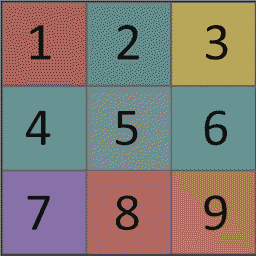
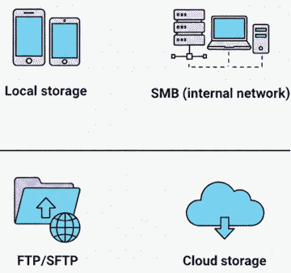

# Visual Icon Gallery

Quick visual reference for FastMediaSorter v2 icons.

---

## 📱 PNG Assets (Copied to spec_v2/assets/)

### Cloud Provider Icons

| Icon | File | Size |
|------|------|------|
|  | `ic_provider_google_drive.png` | 48x48 |
|  | `ic_provider_onedrive.png` | 48x48 |
|  | `ic_provider_dropbox.png` | 48x48 |

---

### Reference Images

| Image | File | Description |
|-------|------|-------------|
|  | `touch_zones_scheme.png` | PlayerActivity gesture zones |
|  | `destinations.png` | Destination badge overlay |
|  | `resource_types.png` | All 6 resource types |

---

### Launcher Icons (XXXHDPI)

| Icon | File | Size |
|------|------|------|
|  | `ic_launcher.png` | 192x192 |
|  | `ic_launcher_adaptive_back.png` | 192x192 |
|  | `ic_launcher_adaptive_fore.png` | 192x192 |

---

## 🎨 Vector Drawables (XML in app_v2/src/main/res/drawable/)

### Resource Types
```
🗂️ ic_resource_local.xml       - Local folders
🌐 ic_resource_smb.xml          - SMB network shares
🔐 ic_resource_sftp.xml         - SFTP/SSH
📁 ic_resource_ftp.xml          - FTP protocol
☁️ ic_resource_cloud.xml        - Cloud storage
⭐ ic_resource_favorites.xml    - Favorites
```

### Media Types
```
🖼️ ic_image.xml                 - Images (JPG/PNG)
🎬 ic_video.xml                 - Videos (MP4/MKV)
🎵 ic_audio.xml                 - Audio (MP3/FLAC)
🎞️ ic_gif.xml                   - Animated GIF
📖 ic_book.xml                  - Documents (PDF/EPUB)
```

### Actions
```
← ic_arrow_back.xml            - Back button
💾 ic_save.xml                  - Save
📤 ic_share.xml                 - Share
✏️ ic_rename.xml                - Rename
✓ ic_check.xml                 - Confirm
✕ ic_cancel.xml                - Cancel
➕ ic_add_24.xml                - Add new
⚙️ ic_settings.xml              - Settings
⋮ ic_more_vert.xml             - Overflow menu
```

### Media Controls
```
▶️ ic_play.xml                  - Play
🔁 ic_repeat.xml                - Repeat all
🔂 ic_repeat_one.xml            - Repeat one
⏩ ic_speed.xml                 - Playback speed
⛶ ic_fullscreen.xml            - Fullscreen
```

### View Controls
```
☰ ic_view_list.xml             - List mode
⊞ ic_view_grid.xml             - Grid mode
🔍+ ic_zoom_in.xml              - Zoom in
🔍- ic_zoom_out.xml             - Zoom out
↻ ic_refresh.xml               - Refresh
```

### Features
```
☆ ic_star_outline.xml          - Favorite (off)
★ ic_star_filled.xml           - Favorite (on)
🔍📄 ic_ocr.xml                  - Text recognition
🌐 ic_translate.xml             - Translation
🎤 ic_microphone.xml            - Voice input
```

---

## 📋 Complete Catalogs

- **[README.md](README.md)** - Full documentation with usage examples (80+ icons)
- **[VECTOR_DRAWABLE_REFERENCE.md](VECTOR_DRAWABLE_REFERENCE.md)** - Quick reference for all vector drawables

---

## 🎯 Icon Categories Summary

| Category | Count | Location |
|----------|-------|----------|
| Resource Types | 6 | Vector (XML) |
| Media Types | 5 + 4 placeholders | Vector (XML) |
| Navigation | 5 | Vector (XML) |
| File Operations | 5 | Vector (XML) |
| Selection | 5 | Vector (XML) |
| Media Controls | 6 | Vector (XML) |
| View Controls | 6 | Vector (XML) |
| General Actions | 6 | Vector (XML) |
| Features | 7 | Vector (XML) |
| Cloud Providers | 3 | PNG (copied here) |
| Backgrounds | 10 | Vector (XML) |
| Badges | 7 | Vector (XML) |
| Touch Zones | 4 | Vector (XML) + 1 PNG |
| Launcher Icons | 3 | PNG (all densities) |

**Total**: 80+ icons (75+ vectors, 10+ PNG assets)

---

**Source**: `app_v2/src/main/res/`  
**Last Updated**: January 6, 2026
