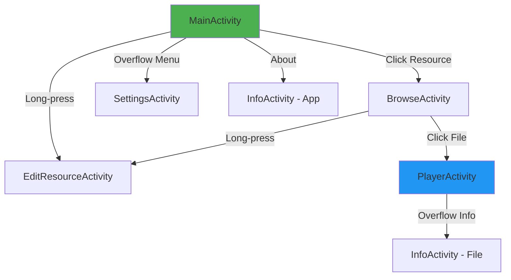

# Navigation Mermaid Diagram

**Last Updated**: January 6, 2026  
**Format**: Mermaid flowchart

## Usage

To render this diagram:
1. **GitHub**: Automatically renders in README.md
2. **VS Code**: Install Mermaid extension
3. **Online**: https://mermaid.live/

## Color Legend
- **Green (#4CAF50)**: Entry point (MainActivity)
- **Blue (#2196F3)**: Media viewer (PlayerActivity)
- **Default**: Standard activities
